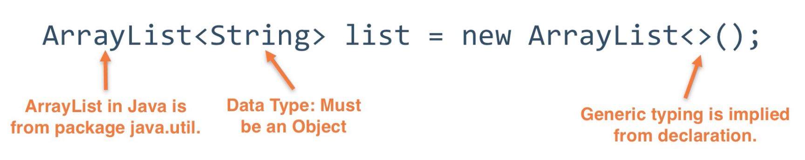
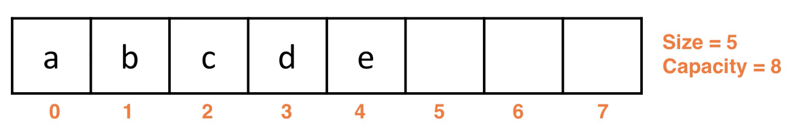
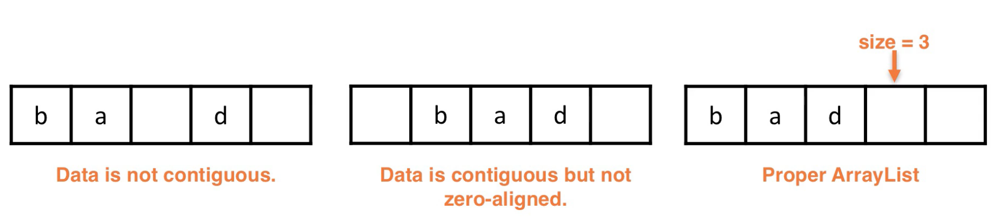
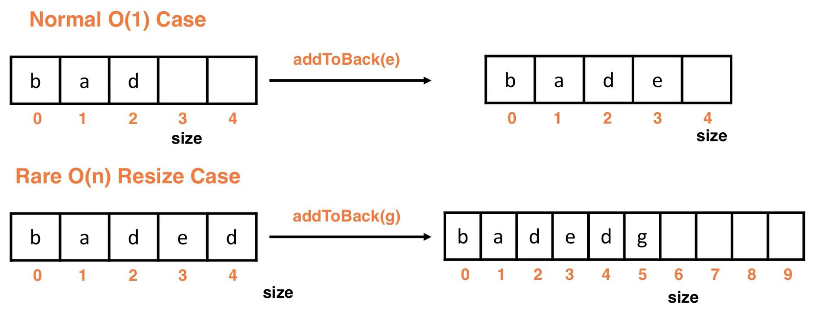
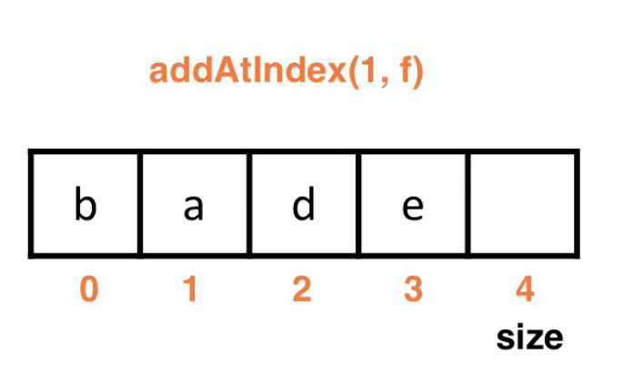
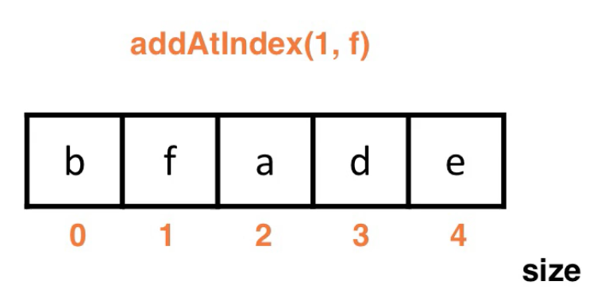
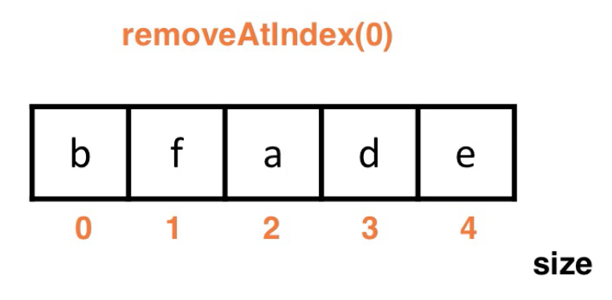

# ArrayList
| 연산 | ArrayList | LinkedList |
| --- | --- | --- |
| 인덱스 끝에 삽입 |  O(1) or  O(n) |  O(1) |
| 인덱스 중간에 삽입 |  O(n) |  O(n) |
| 인덱스 끝에서 삭제 |  O(1) |  O(1) |
| 조회 |  O(1) |  O(n) |

### 인덱스 끝에 삽입, 삭제

**ArrayList**의 경우 삽입시 공간이 가득 찰 경우 공간을 1.5배로 할당해주는 **더블링**이 일어나고, 이럴 경우에  O(n)의 시간복잡도가 소요됩니다.

### 인덱스 중간에 삽입, 삭제

배열 중간에 삽입하는 경우 **ArrayList**는 데이터를 삽입, 삭제하고 나머지 데이터들은 새로운 공간에 복사해 주어야하기에  O(n)의 시간 복잡도를 가집니다. **LinkedList**의 경우 탐색하는데  O(n)의 시간복잡도를 가지고, 실제 삽입, 삭제는 노드끼리 연결만 처리 해주면 되기에  O(1) 시간복잡도를 가지며 결과적으로는  O(n)의 시간복잡도를 가집니다.

### 조회

배열의 데이터를 조회하는 경우 **ArrayList**는 인덱스를 통해 조회하면  O(1)의 시간복잡도를 가지고, **LinkedList**는 앞에서부터 노드를 타고 조회해야하기에  O(n)의 시간복잡도를 가집니다.

> 비슷한 시간 복잡도라도 **ArrayList**는 **인덱스 끝에서의 삽입과 삭제가 빠르고**, **LinkedList**는 **인덱스 중간에서의 삽입과 삭제가 빠르다**.
> 
> 로직상 배열의 끝에 삽입할 경우가 많다면 LinkedList 보다는 ArrayList 를 사용하고, 배열의 앞이나 중간 값을 삭제할 경우가 많다면 LinkedList 를 사용하자!

---
# ArrayList

: ArrayList consists of a sequence of cells.

- A type of List **backed by an array**.
  - Which means they share a lot of the same properties and limitations.
  - Lists are an Abstract Data Type(**ADT**) and ArrayList is as well .

- The generic ArrayList data structure is a wrapper for the array.
- ArrayLists are **automatically resized** when they reach capacity.
- **Dynamically** allocated in that the array is **reallocated** and **copied** when more space is necessary.
  - Dynamic memory solves the problem of static arrays.
  - We consider the ArrayList to be dynamic because users can add as much data as they want without having to call a specific resize method.

- **addAtIndex(int index, T data):** Adds the **data** to the list at the specified **index** . Any data with index i ≥ **index** has a new index i+1 to make room for the new **data**.
- **removeAtIndex(int index):** Removes the **data** at the specified **index** from the list. Any data with index i > **index** has a new index i-1 to maintain the sequence.
- **get(int index):** Returns the data at the specified **index**.
- **isEmpty():** Returns whether the list is empty or not.
- **clear():** Resets the list to an initial configuration with no data.
- **size():** Returns the number of data currently stored in the list.

---
## Terminology

- size
  - the number of data (non-null) being stored in it
  - 현재 저장된 데이터 수
- capacity
  - the number of data that can be stored without a resize
  - 저장할 수 있는 데이터 수

---
## Requirements

- Data must be **contiguous**.
  - It cannot have any null spaces between data elements
- All cells must **be populated beginning with the cell at index 0.**
- For efficient operations, the size should be stored. Index size gives access to the next empty spot in  O(1).
---
## Adding to the Back

- If we have reached the capacity of the ArrayList, we have to resize the ArrayList before we can add the next element to the back.
- **We are facing a cost of  O(n) to resize and copy all of the data over before adding to the back.**
---
## Amortized analysis of Adding to the Back

- Amortize : (채무를) 상환하다
- **Under a typical worst case analysis, adding to the back is  O(n).**
  - This is pessimistic since the resize step is rare.
- **Amortized Analysis**
  - Look at the cost over time rather than the cost per add operation.
  - Adding to the back is ** O(1)** if we use ab amortized analysis.

  분할상환분석(Amortized Analysis)은 평소에는 항상 빠르게 작동하지만 때때로 매우 느리게 작동하는 알고리즘을 분석할때 사용할 수 있는 분석 방법이다. 우리가 자주 사용하는 빅오 표기법을 이용하면 최악의 상황만을 나타내기 때문에 이런 경우에는 빅오만 가지고 제대로 수행시간을 짐작하기가 힘들다. 그래서 개별 수행시간에 대한 최악의 상황을 생각할 것이 아니라, 전체 수행시간의 최악을 생각하여 그 전체 수행시간에 대한 평균 수행시간을 구해보자는 것이 분할 상환 분석의 핵심이라고 할 수 있다.
---

## Adding Elsewhere

- Adding at an arbitrary index that is not the back is ** O(n)**.
  - We must **shift** data around to keep contiguity of data.
  - We have shifted the data a, d, and e down once cell to open up index 1 and insert data f.
---
## Removing

- Removing from the back is  O(1).
- Removing from an arbitrary index not at the back is  O(n) due to shifting.
  - When we remove from anywhere other than the back, the remaining data elements will shift one by one until the data becomes contiguous.